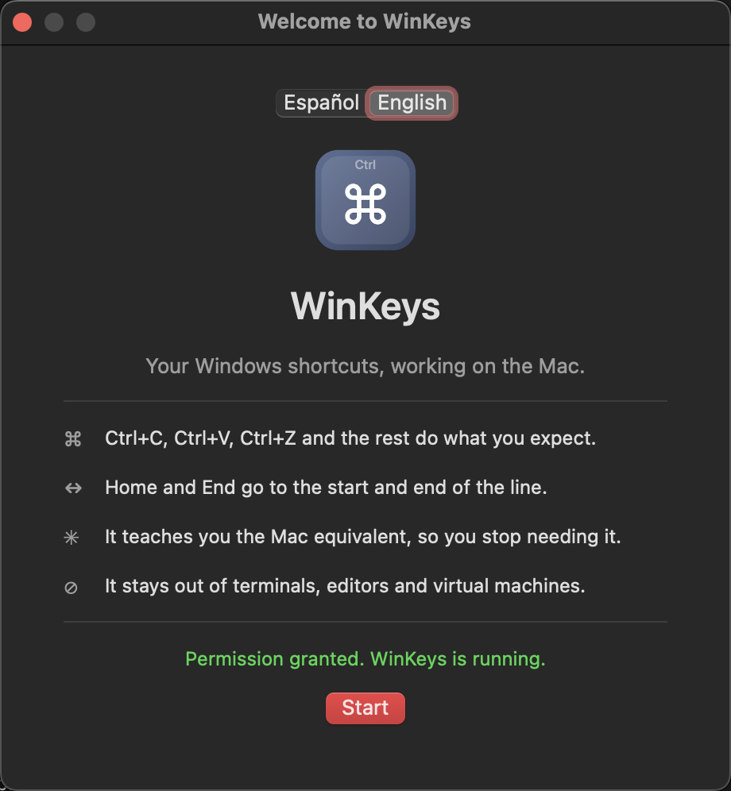
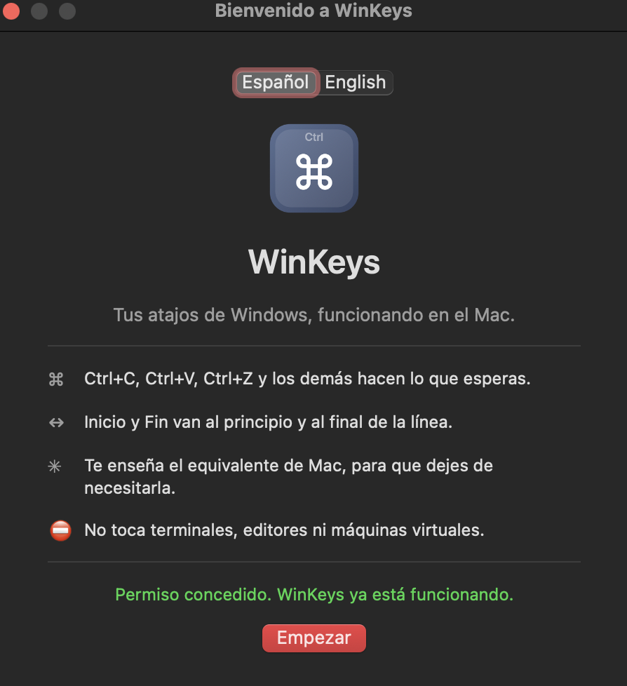

# WinKeys

**English** · [Español](README.es.md)

**Your Windows keyboard habits, working on the Mac.**

You just switched to a Mac. `Ctrl+C` does nothing. `Home` jumps to the top of the
document instead of the start of the line. Every day you reach for a shortcut
that used to work, and every day the Mac ignores it.

WinKeys fixes that with one switch and no configuration.

<p align="center">
  
</p>

## What it does

| You press | WinKeys makes it | 
|---|---|
| `Ctrl+C` `Ctrl+V` `Ctrl+X` | Copy, paste, cut |
| `Ctrl+Z` / `Ctrl+Y` | Undo / redo |
| `Ctrl+A` `Ctrl+S` `Ctrl+F` `Ctrl+P` `Ctrl+O` `Ctrl+N` | The obvious thing |
| `Home` / `End` | Start / end of the **line** |
| `Ctrl+Home` / `Ctrl+End` | Start / end of the document |

And it tells you what the Mac shortcut is called, every time it translates one.
The goal is that you stop needing it.

## It stays out of the way

`Ctrl+C` in a terminal means *interrupt*, not *copy*. Inside a virtual machine
the guest OS already speaks Windows. Translating there would break things you
depend on, so WinKeys never touches:

Terminal · iTerm2 · Warp · Alacritty · kitty · WezTerm · Hyper · Tabby ·
VS Code · Cursor · JetBrains · Sublime · Zed · Parallels · VMware Fusion ·
UTM · VirtualBox · Microsoft Remote Desktop · Screen Sharing · TeamViewer ·
AnyDesk · Termius

You can add your own.

## Privacy

WinKeys reads the keys you press so it can translate them, and nothing else.

- It does **not** store what you type.
- It does **not** send anything anywhere.
- It connects to the internet **only** when you press "Check for Updates".
- It never installs an update on its own. It opens the release page and you decide.

The code is here. An app that sees every keystroke should be one you can read,
so this one is [GPL-3.0](LICENSE) and always will be.

## Requirements

- **macOS 10.13 High Sierra or later** — including Macs that cannot go further
- **Intel and Apple Silicon** — one universal binary, no separate downloads
- The **Accessibility** permission, which is what allows reading the keyboard.
  Nothing else.

## Install

**[⬇ Download WinKeys 0.1.0](https://github.com/neural-beat/winkeys/releases/latest/download/WinKeys-0.1.0.zip)**

> **Download `WinKeys-0.1.0.zip`, not "Source code (zip)".**
> The source archive contains the code, not the app — there is no `.app` inside
> it, and nothing will happen when you open it. The file you want is the one
> named `WinKeys-<version>.zip`.

1. Unzip it and drag `WinKeys.app` to your Applications folder.
2. **Right-click the app → Open → Open.** WinKeys is not notarised by Apple, so
   a plain double-click is refused the first time.
3. Grant the Accessibility permission when asked.

If macOS still refuses to open it:

```bash
xattr -dr com.apple.quarantine /Applications/WinKeys.app
```

### Where is it after opening?

**In the menu bar, not the Dock.** WinKeys has no Dock icon and no main window —
look for the keyboard icon at the top right of your screen. Everything is in that
menu: the on/off switch, the language, and whether it opens at login.

## Build it yourself

```bash
git clone https://github.com/neural-beat/winkeys.git
cd winkeys
./Tools/setup-signing.sh   # optional, keeps permissions across rebuilds
./build.sh
```

`./build.sh` produces a universal `build/stage/WinKeys.app`. The signing script
creates a self-signed certificate locally; without it every build gets a new
identity and macOS asks for the Accessibility permission again each time.

## Languages

English and Spanish. It follows your system on first launch and you can change
it from the welcome screen or the menu bar at any time.

<p align="center">
  
</p>

## Licence

GPL-3.0-or-later. Created by [neural-beat](https://github.com/neural-beat).
